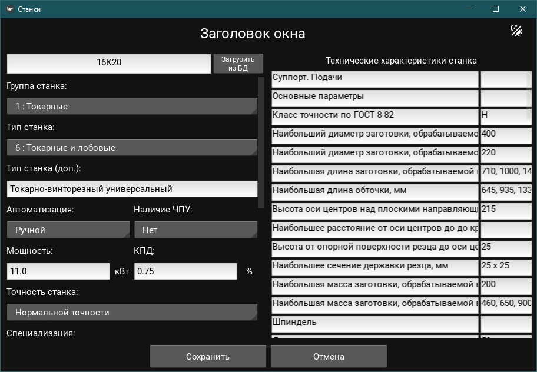

# Machine Tools GUI

Графический интерфейс для работы с базой данных станков и их технических требований.

> Данное приложение является GUI-оберткой над пакетом 
> [](https://github.com/sad-engineer/machine_tools)


## Описание

Приложение предоставляет удобный интерфейс для:
- Просмотра и редактирования данных о станках
- Управления техническими требованиями

### Основные функции
- Поиск станков по имени
  
- Просмотр детальной информации о станке:
  - Основные характеристики
  - Габариты
  - Технические требования

- Управление данными:
  - Редактирование существующих записей

## Установка

### Вариант 1: Poetry (рекомендуется)
```bash
poetry add git+https://github.com/sad-engineer/machine_tools_gui_kivi.git
```

### Вариант 2: pip
```bash
pip install git+https://github.com/sad-engineer/machine_tools_gui_kivi.git
```

### Установите зависимости:
```bash
poetry install
```

## Подготовка базы данных станков

### Настройка PostgreSQL

Установите PostgreSQL, если еще не установлен:
   - Windows: скачайте установщик с [официального сайта](https://www.postgresql.org/download/windows/)
   - Linux: `sudo apt-get install postgresql`
   - Mac: `brew install postgresql`

### Устанавливаем базу данных 

Проект использует базу данных станков. 

База данных содержится в пакете machine_tools, который устанавливается при установке зависимостей. 

Но перед использованием, необходимо инициализировать эту базу.

```bash
# Вариант 1: Используя команду machine_tools
machine_tools init

# Вариант 2: Через Python модуль
python -m machine_tools.app.db.init_db
```

## Структура проекта
```
machine_tools_gui_kivi
└---app
    └---components
    └---windows
    └---app.py
└---src
    └---descriptions.py
    └---machine_finder.py
└---__init__.py
└---__main__.py
settings
└---machine_tools.env
```

## Использование

1. Запустите приложение:

```bash
python machine_tools_gui_kivi run
```

2. Введите название станка в поле поиска 
3. Нажмите кнопку "Загрузить из БД"




### Требования
- Python 3.9+
- Kivy 2.2.0+
- Kivymd 1.2.0+
- PostgreSQL 12+