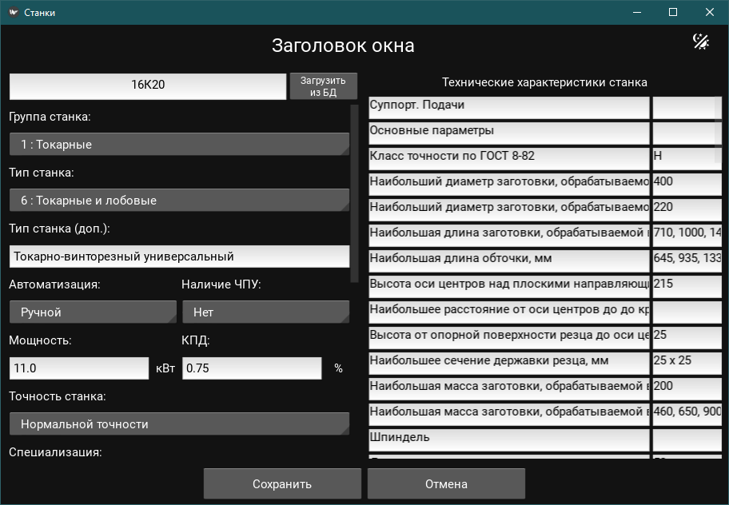

# Machine Tools GUI

Графический интерфейс для работы с базой данных станков и их технических требований.

> Данное приложение является GUI-оберткой над пакетом 
> [](https://github.com/sad-engineer/machine_tools)


## Описание

Приложение предоставляет удобный интерфейс для:
- Просмотра и редактирования данных о станках
- Управления техническими требованиями

### Основные функции
- Поиск станков по имени
  
- Просмотр детальной информации о станке:
  - Основные характеристики
  - Габариты
  - Технические требования

- Управление данными:
  - Редактирование существующих записей

## Установка

### Вариант 1: Poetry (рекомендуется)
```bash
poetry add git+https://github.com/sad-engineer/machine_tools_gui_kivi.git
```

### Вариант 2: pip
```bash
pip install git+https://github.com/sad-engineer/machine_tools_gui_kivi.git
```

### Установите зависимости:
```bash
poetry install
```

**Примечание:** Пакет `machine_tools` устанавливается автоматически как зависимость проекта.

## Инициализация базы данных

### Настройка PostgreSQL

1) Установите PostgreSQL, если еще не установлен:
   - Windows: скачайте установщик с [официального сайта](https://www.postgresql.org/download/windows/)
   - Linux: `sudo apt-get install postgresql`
   - Mac: `brew install postgresql`

2) Запустите сервер PostgreSQL, если еще не запущен:
```bash
# Windows (если установлен в стандартную папку)
"C:\Program Files\PostgreSQL\17\bin\pg_ctl.exe" start -D "C:\Program Files\PostgreSQL\17\data"

# Linux
sudo systemctl start postgresql

# Mac
brew services start postgresql
```

3) Создайте подключение для работы с базой данных по станкам:
```powershell
.\psql.exe -U postgres -c "CREATE USER your_user WITH PASSWORD 'your_password';"
```

4) Передайте созданному пользователю права для работы с базой
```powershell
.\psql.exe -U postgres -h localhost -p 5432 -c "ALTER ROLE your_user CREATEDB;"
```

### Настройка пакета для работы с данными

Проект использует базу данных станков. База данных поставляется с пакетом machine_tools. 
Перед использованием пакетных данных, необходимо инициализировать данные.

1) Передайте настройки подключения:
```bash
machine_tools setup-db-connection
# или просто запустите любую команду, мастер настройки запустится автоматически
```

2) Установите базу данных

```bash
# Используя команду machine_tools
machine_tools init
```

### Мастер настройки

При первом запуске любой команды (например, `machine_tools status`), если файл настроек отсутствует, автоматически запустится мастер первоначальной настройки.

Мастер запросит у вас:
- **Хост PostgreSQL** 
- **Порт PostgreSQL** 
- **Пользователь PostgreSQL**
- **Пароль PostgreSQL**

После ввода настроек автоматически проверяется подключение к серверу PostgreSQL.

### Файл настроек

Настройки сохраняются в файл `settings/machine_tools.env`:

```env
# Настройки базы данных
POSTGRES_USER=postgres_user
POSTGRES_PASSWORD=your_password
POSTGRES_HOST=localhost
POSTGRES_PORT=5432
POSTGRES_DB=machine_tools

# Настройки приложения
APP_NAME=Machine Tools
DEBUG=True
API_V1_STR=/api/v1
```

## Использование

1. Запустите приложение:

```bash
python machine_tools_gui_kivi run
```

2. Введите название станка в поле поиска 
3. Нажмите кнопку "Загрузить из БД"




### Требования
- Python 3.9+
- Kivy 2.2.0+
- Kivymd 1.2.0+
- PostgreSQL 12+